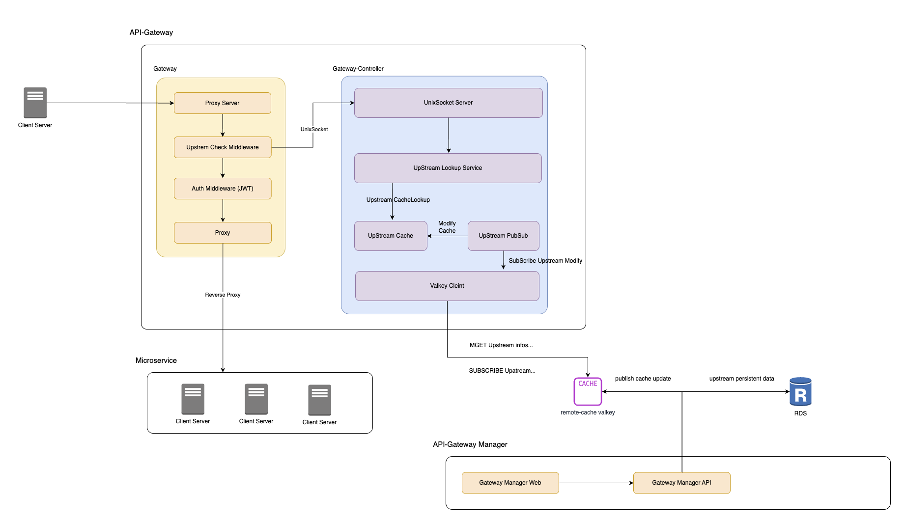

# archway

`archway`는 두 개의 Go 애플리케이션으로 구성된 라우팅 게이트웨이 프로젝트입니다.

- `app/gateway`: 외부 요청을 수신하고 실제 업스트림으로 프록시하는 데이터 플레인
- `app/gateway-controller`: 라우팅 정책을 조회/제공하는 컨트롤 플레인

핵심 의도는 **요청 처리(프록시)와 라우팅 정책 결정(조회/관리)을 분리**하여, 빠른 요청 처리를 유지하면서 정책 변경에 유연하게 대응하는 것입니다.


## 기본 개념



## Why This Project

이 프로젝트는 다음 목적을 갖습니다.

- 요청 경로 기반 업스트림 라우팅
- 경로 재작성(path rewrite) 및 캐시 헤더 같은 게이트웨이 처리
- 라우팅 정책 로직을 별도 서비스로 분리하여 확장성 확보
- 공통 라우팅 모델/로직을 `common` 모듈로 공유

## Why Build It Ourselves

Spring Boot 기반 API Gateway(예: Spring Cloud Gateway)나 다른 상용/오픈소스 게이트웨이를 쓰지 않고 직접 구현한 이유는 다음과 같습니다.

- 서비스 요구사항에 맞는 최소 기능만 구현해 데이터 플레인을 가볍게 유지
- `gateway`와 `gateway-controller` 분리 구조를 통해 정책 변경과 요청 처리를 독립적으로 운영
- Unix socket 기반 내부 조회 등 현재 런타임/배포 환경에 최적화된 통신 방식 사용
- 경로 파싱/재작성/업스트림 조회 규칙을 도메인에 맞게 세밀하게 제어
- 프레임워크 추상화 제약 없이 에러 포맷, 헤더 정책, 미들웨어 동작을 일관되게 통합
- 특정 벤더나 프레임워크 버전에 대한 종속성을 낮춰 장기 유지보수 리스크 완화

직접 구현은 초기 개발/운영 책임이 증가한다는 단점이 있지만, 이 프로젝트는 라우팅 규칙과 제어 흐름이 핵심 도메인 로직이기 때문에 해당 트레이드오프를 수용하는 방향을 선택했습니다.

## Why Go 
이 프로젝트를 Go로 작성한 이유는 다음과 같습니다.

- 게이트웨이의 핫패스(요청 수신, 라우팅 매칭, 프록시 전달)에서 낮은 런타임 오버헤드 확보
- 단일 바이너리 배포가 쉬워 운영 단순성 확보 (컨테이너 이미지/실행 환경 단순화)
- 표준 라이브러리 수준에서 HTTP 서버, Reverse Proxy, 네트워크 처리를 일관되게 구성 가능
- 고루틴과 컨텍스트 기반 동시성 모델이 I/O 중심 게이트웨이 워크로드에 적합
- 초기 기동 시간과 메모리 사용량 측면에서 경량 서비스 운영에 유리
`

## Project Structure

```text
app/
  gateway/              # Reverse proxy 서버
  gateway-controller/   # Upstream 라우팅 조회 서버 (Unix socket)
common/
  model/                # 공통 도메인 모델 및 라우팅 로직
```

## Components

### 1) gateway

주요 역할:

- 클라이언트 HTTP 요청 수신
- 요청 경로를 기준으로 `gateway-controller`에 업스트림 조회
- 조회 결과를 기반으로 업스트림 URL 재작성 후 Reverse Proxy 수행
- 에러 응답/헤더 처리

특징:

- `UPSTREAM_LOOKUP_BASE_URL` 기본값: `http://unix/v1/upstream?path=`
- Unix socket 기반 HTTP 클라이언트를 통해 controller와 통신

### 2) gateway-controller

주요 역할:

- `/v1/upstream?path=...` 엔드포인트 제공
- 요청 path를 파싱해 서비스/도메인/리소스 경로 매칭
- 라우팅 규칙에 맞는 upstream 정보 반환

특징:

- Unix socket 서버로 동작 (`UNIX_SOCKET_PATH`)
- 라우팅 데이터 소스(예: Valkey)와 연동 가능한 구조

### 3) common

주요 역할:

- 업스트림 도메인 모델
- path router(Trie 기반) 등 재사용 가능한 라우팅 로직
- 서비스 간 공유되는 DTO/모델

## Request Flow

1. 클라이언트가 `gateway`로 요청을 보냄
2. `gateway`는 요청 path를 `gateway-controller`의 `/v1/upstream`으로 조회
3. `gateway-controller`가 path를 해석해 업스트림 정보 반환
4. `gateway`가 반환된 정보로 경로를 재작성하고 업스트림으로 프록시
5. 응답을 클라이언트에 전달

