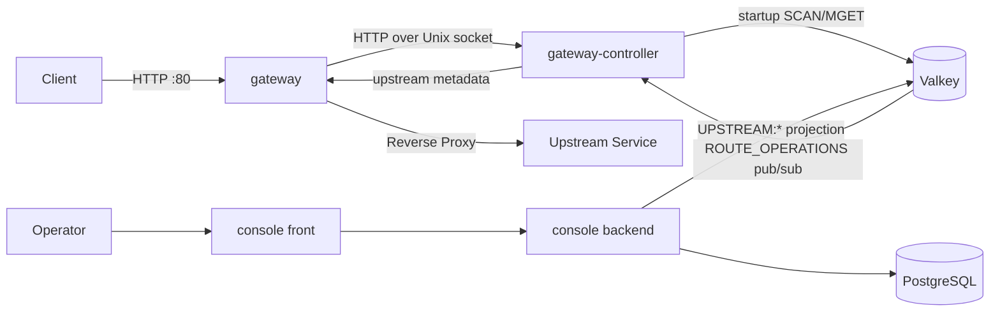

# go-api-archway

`go-api-archway`는 라우팅 정책 관리와 HTTP 프록시 처리를 분리한 API Gateway 프로젝트입니다.

> 1. README.md 문서는 Github Copilot 이 초안을 작성하고 검수하였습니다.
> 2. console(backoffice) 는 Github Copilot 을 이용한 Vibe Coding 으로 작성되었습니다.
> 3. 성능 테스트는 Copilot 이 진행하였습니다.


- `gateway`: 외부 HTTP 요청을 받고 upstream으로 전달하는 data plane
- `gateway-controller`: Valkey의 라우팅 정책을 메모리에 적재하고 Unix socket으로 lookup을 제공하는 control plane
- `core`: 라우팅, JWT, 오류 응답 등 Go 애플리케이션이 공유하는 도메인 모듈
- `console`: PostgreSQL에서 정책을 관리하고 Valkey projection과 변경 이벤트를 발행하는 backoffice

## Architecture


```mermaid
flowchart LR
    Client[Client] -->|HTTP :80| Gateway[gateway]
    Gateway -->|HTTP over Unix socket| Controller[gateway-controller]
    Controller -->|startup SCAN/MGET| Valkey[(Valkey)]
    Valkey -->|ROUTE_OPERATIONS pub/sub| Controller
    Controller -->|upstream metadata| Gateway
    Gateway -->|Reverse Proxy| Upstream[Upstream Service]

    Operator[Operator] --> ConsoleFront[console front]
    ConsoleFront --> ConsoleBackend[console backend]
    ConsoleBackend --> PostgreSQL[(PostgreSQL)]
    ConsoleBackend -->|UPSTREAM:* projection| Valkey
```

요청 처리와 정책 관리를 분리해 gateway의 hot path에서는 Valkey를 직접 조회하지 않습니다. `gateway-controller`가 시작 시 route를 로컬 메모리에 적재하고 이후 lookup은 메모리 기반으로 처리합니다.

## Repository Structure

```text
.
├── archway/
│   ├── gateway/                 # HTTP reverse proxy
│   ├── gateway-controller/      # Unix socket route lookup server
│   ├── .docker/                 # 통합 컨테이너 이미지
│   └── Makefile
├── core/                        # 공유 Go 도메인, router, JWT, error, utility
├── console/
│   ├── front/                   # React + Vite backoffice UI
│   └── backend/                 # Express + PostgreSQL + Valkey API
└── README.md
```

## Request Flow

1. 클라이언트가 gateway에 HTTP 요청을 전송합니다.
2. gateway middleware가 요청 path를 gateway-controller의 `/v1/upstream`으로 전달합니다.
3. gateway-controller가 service, domain, resource path를 파싱합니다.
4. 메모리 route cache에서 upstream host, path, method, timeout, 인증 정책을 조회합니다.
5. gateway가 lookup 결과로 요청 URL을 재작성하고 upstream에 전달합니다.
6. upstream 응답을 클라이언트에 반환합니다.

gateway 요청 URI는 다음 형식을 사용합니다.

```text
/v1/{service-name}/{resource-domain}/{resource-path...}
```

예시:

```text
/v1/member-api/api.example.com/api/users
```

현재 resource domain은 HTTP `Host` 헤더가 아니라 URI의 세 번째 segment에서 추출합니다.

## Route Model

gateway-controller는 Valkey의 `UPSTREAM:{service-name}` key를 읽습니다.

```json
{
  "service_name": "member-api",
  "resources": [
    {
      "sub_domain": "api.example.com",
      "host": "127.0.0.1:18081",
      "paths": [
        {
          "path": "/api/users",
          "method": "GET",
          "request_timeout": 3000,
          "response_timeout": 5000,
          "check_authorization": false,
          "cache_timeout": 15
        }
      ]
    }
  ]
}
```

### Path Matching

- service: URI 두 번째 segment
- resource domain: URI 세 번째 segment
- resource path: domain 이후 path
- 정적 path와 `{parameter}` 형식의 동적 path를 Trie router로 지원
- 일치하는 domain이 없으면 `sub_domain: ""` resource를 fallback으로 조회

### Authorization

`check_authorization`이 `true`인 route는 JWT 검증을 수행합니다.

```json
{
  "authorization": {
    "algorithm": "HS256",
    "key_data": "<base64 encoded JWK>",
    "user_key": "user_id"
  }
}
```

지원 알고리즘은 `RS256`, `ES256`, `HS256`입니다. 검증된 claim은 upstream 요청의 `X-USER` 헤더로 전달됩니다.

## Route Synchronization

console backend는 PostgreSQL을 source of truth로 사용하고 다음 projection을 Valkey에 반영합니다.

- key: `UPSTREAM:{service-name}`
- pub/sub channel: `ROUTE_OPERATIONS`
- operation: `ADD`, `UPDATE`, `DELETE`

gateway-controller는 시작 시 `UPSTREAM:*`을 `SCAN + MGET`으로 로드하고, 실행 중에는 `ROUTE_OPERATIONS` 이벤트를 받아 로컬 cache를 갱신합니다.

## Requirements

- Go `1.26.1`
- Wire `v0.7.0` — `make build`가 없으면 자동 설치
- Docker
- Valkey
- Node.js 및 npm — console 실행 시
- PostgreSQL — console backend 실행 시

## Build

### Go applications

```bash
cd archway
make build
```

산출물:

```text
archway/.build/gateway
archway/.build/gateway-controller
```

Wire 코드만 다시 생성하려면:

```bash
cd archway
make wire
```

### Console

```bash
cd console
npm install
npm run build
```

## Runtime Configuration

### gateway

| Environment variable | Default | Description |
|---|---:|---|
| `GATEWAY_CONTROLLER_UPSTREAM_LOOKUP_BASE_URL` | `http://unix/v1/upstream?path=` | controller lookup URL |
| `GATEWAY_CONTROLLER_SERVER_NETWORK` | `unix` | controller network |
| `GATEWAY_CONTROLLER_UNIX_SOCKET_PATH` | `/tmp/gateway-controller.sock` | controller Unix socket |
| `HTTP_CLIENT_MAX_IDLE_CONNS` | `250` | HTTP client idle connection limit |
| `HTTP_CLIENT_MAX_IDLE_CONNS_PER_HOST` | `500` | host별 idle connection limit |
| `HTTP_CLIENT_IDLE_CONN_TIMEOUT` | `90` | idle timeout, seconds |
| `HTTP_CLIENT_TIMEOUT_MILLISECONDS` | `5000` | controller request timeout |

gateway HTTP listen address는 현재 `:80`입니다.

### gateway-controller

| Environment variable | Default | Description |
|---|---:|---|
| `UNIX_SOCKET_PATH` | `/tmp/gateway-controller.sock` | Unix socket path |
| `READ_TIMEOUT_MILLISECOND` | `10` | Unix HTTP server read timeout |
| `WRITE_TIMEOUT_MILLISECOND` | `10` | Unix HTTP server write timeout |
| `IDLE_TIMEOUT_MILLISECOND` | `120` | Unix HTTP server idle timeout |
| `VALKEY_MASTER_HOST` | required | Valkey master address |
| `VALKEY_REPLICA_HOSTS` | empty | comma-separated replica addresses |
| `VALKEY_READFROM` | `master` | Valkey read policy |

`.env`는 선택 사항이며 실제 환경변수로 모든 설정을 전달할 수 있습니다.

### console backend

| Environment variable | Default | Description |
|---|---:|---|
| `PORT` | `8080` | backend listen port |
| `POSTGRES_CONNECTION_STRING` | required | PostgreSQL connection string |
| `VALKEY_URL` | required | Valkey connection URL |
| `OUTBOX_POLL_INTERVAL_MS` | `3000` | outbox polling interval |
| `OUTBOX_BATCH_SIZE` | `10` | outbox batch size |

## Local Run

Valkey가 `127.0.0.1:6379`에서 실행 중이라고 가정합니다.

### 1. gateway-controller

```bash
cd archway/gateway-controller
VALKEY_MASTER_HOST=127.0.0.1:6379 \
go run ./cmd
```

### 2. gateway

```bash
cd archway/gateway
go run ./cmd
```

gateway-controller를 먼저 시작해야 gateway가 Unix socket lookup을 수행할 수 있습니다.

## End-to-End Test

다음 예제는 임시 upstream 서버를 만들고 실제로
`gateway -> gateway-controller -> upstream` 흐름을 확인합니다.

### 1. Temporary upstream

```bash
python3 -u -c '
from http.server import BaseHTTPRequestHandler, ThreadingHTTPServer
import json

class Handler(BaseHTTPRequestHandler):
    def do_GET(self):
        body = json.dumps({
            "upstream": "ok",
            "method": self.command,
            "path": self.path,
            "request_host": self.headers.get("X-Request-Host"),
        }).encode()
        self.send_response(200)
        self.send_header("Content-Type", "application/json")
        self.send_header("Content-Length", str(len(body)))
        self.end_headers()
        self.wfile.write(body)

ThreadingHTTPServer(("127.0.0.1", 18081), Handler).serve_forever()
'
```

### 2. Seed route

실행 중인 Valkey container 이름이 `valkey-master`인 예시입니다.

```bash
docker exec valkey-master valkey-cli SET 'UPSTREAM:e2e-service' \
'{"service_name":"e2e-service","resources":[{"sub_domain":"echo.local","host":"127.0.0.1:18081","paths":[{"path":"/echo/ping","method":"GET","request_timeout":3000,"response_timeout":5000,"check_authorization":false,"cache_timeout":15}]}]}'
```

route는 gateway-controller 시작 전에 등록하거나, 등록 후 `ROUTE_OPERATIONS` update event를 발행해야 합니다.

### 3. Start gateway-controller

```bash
cd archway/gateway-controller
VALKEY_MASTER_HOST=127.0.0.1:6379 \
UNIX_SOCKET_PATH=/tmp/gateway-controller-e2e.sock \
go run ./cmd
```

controller lookup을 직접 확인할 수 있습니다.

```bash
curl --unix-socket /tmp/gateway-controller-e2e.sock \
  'http://unix/v1/upstream?path=/v1/e2e-service/echo.local/echo/ping'
```

### 4. Start gateway

```bash
cd archway/gateway
GATEWAY_CONTROLLER_UNIX_SOCKET_PATH=/tmp/gateway-controller-e2e.sock \
go run ./cmd
```

### 5. Send request

```bash
curl -i \
  -H 'Host: gateway.local' \
  'http://127.0.0.1/v1/e2e-service/echo.local/echo/ping?source=e2e'
```

예상 upstream 응답:

```json
{
  "upstream": "ok",
  "method": "GET",
  "path": "/echo/ping?source=e2e",
  "request_host": "gateway.local"
}
```

## Test

### gateway

```bash
cd archway/gateway
go test ./...
```

### gateway-controller

Valkey master와 replica test 환경이 필요합니다.

```bash
cd archway/gateway-controller
go test ./...
```

전체 benchmark:

```bash
cd archway/gateway-controller
go test ./... -run '^$' -bench . -benchmem
```

### console

```bash
cd console
npm test
npm run build
```

## Benchmark

측정 환경:

- Apple M4, Darwin arm64
- Go `1.26.1`
- Valkey `8.0.2`
- gateway, gateway-controller, upstream 모두 localhost
- HTTP keep-alive 사용
- E2E 경로: `gateway -> Unix socket -> gateway-controller -> gateway -> upstream`
- 각 latency benchmark 3회 실행 후 중앙값에 가까운 결과 사용

아래 값은 로컬 loopback 기준입니다. 실제 Kubernetes 환경에서는 node CPU 세대, CNI, sidecar, TLS, upstream latency에 따라 달라집니다.

### JWT Codec

| Algorithm | Operation | Time | Memory | Allocations |
|---|---|---:|---:|---:|
| HS256 | sign | 1.20µs | 2,114 B/op | 35 allocs/op |
| HS256 | verify | 1.69µs | 2,392 B/op | 48 allocs/op |
| RS256 | sign | 856µs | 8,621 B/op | 76 allocs/op |
| RS256 | verify | 23.3µs | 3,640 B/op | 53 allocs/op |
| ES256 | sign | 16.7µs | 8,531 B/op | 97 allocs/op |
| ES256 | verify | 38.0µs | 3,288 B/op | 65 allocs/op |

gateway 요청에서는 token을 생성하지 않고 검증만 수행하므로 verify 비용이 중요합니다.

- HS256이 가장 빠르고 할당량도 가장 작습니다.
- RS256 verify는 ES256보다 빠르지만 sign 비용은 크게 높습니다.
- ES256 verify는 세 알고리즘 중 가장 높은 CPU 비용을 사용합니다.

실행 명령:

```bash
cd core
go test ./gjwt -bench 'Benchmark(RSA|ECDSA|HMAC)' -benchmem -count=3
```

### Gateway Controller

Unix socket HTTP 요청, route lookup, JSON 응답 생성을 모두 포함합니다.

| Scenario | Time | Memory | Allocations | Theoretical ops/s |
|---|---:|---:|---:|---:|
| Basic lookup | 19.2µs | 7,182 B/op | 80 allocs/op | 약 52K |
| No JWT | 18.6µs | 6,963 B/op | 80 allocs/op | 약 53K |
| HS256 verify | 23.1µs | 10,726 B/op | 136 allocs/op | 약 43K |
| RS256 verify | 51.0µs | 12,306 B/op | 141 allocs/op | 약 19K |
| ES256 verify | 66.7µs | 11,674 B/op | 153 allocs/op | 약 15K |

`Theoretical ops/s`는 단일 요청의 `ns/op` 역수이며 실제 동시 처리량과 동일하지 않습니다.

실행 명령:

```bash
cd archway/gateway-controller
go test ./adapter/config \
  -run '^$' \
  -bench 'BenchmarkUnixServerLookupRouteOverUnixSocket($|WithValkeyAndJWT)' \
  -benchmem \
  -count=3
```

### Gateway End-to-End

#### Sequential

| Scenario | Throughput | Average | P50 | P95 | P99 |
|---|---:|---:|---:|---:|---:|
| No JWT | 10.4K req/s | 95.7µs | 88.8µs | 120.5µs | 247µs |
| HS256 | 9.9K req/s | 100.6µs | 93.8µs | 129.9µs | 254µs |
| RS256 | 7.8K req/s | 128.0µs | 120.3µs | 170.6µs | 297µs |
| ES256 | 7.0K req/s | 142.0µs | 135.5µs | 165.8µs | 285µs |

#### Concurrency 16

| Scenario | Throughput | Average | P50 | P95 | P99 |
|---|---:|---:|---:|---:|---:|
| No JWT | 25.6K req/s | 622µs | 576µs | 1.10ms | 1.47ms |
| HS256 | 21.9K req/s | 726µs | 707µs | 1.22ms | 1.53ms |
| RS256 | 21.6K req/s | 736µs | 708µs | 1.26ms | 1.64ms |
| ES256 | 21.1K req/s | 754µs | 719µs | 1.29ms | 1.77ms |

모든 시나리오에서 실패 요청은 없었고 P99 latency는 2ms 미만이었습니다.

### CPU and Memory

동시성 16으로 15초간 지속 부하를 가한 결과입니다. CPU `100%`는 논리 CPU 1 core 사용량입니다.

| Scenario | Sustained throughput | Gateway CPU | Controller CPU | Combined CPU | Combined RSS |
|---|---:|---:|---:|---:|---:|
| No JWT | 27.1K req/s | 약 4.1 cores | 약 0.9 cores | 약 5.0 cores | 약 53 MiB |
| HS256 | 22.2K req/s | 약 3.9 cores | 약 1.0 cores | 약 4.9 cores | 약 51 MiB |
| RS256 | 22.2K req/s | 약 3.7 cores | 약 2.1 cores | 약 5.8 cores | 약 54 MiB |
| ES256 | 18.3K req/s | 약 3.5 cores | 약 2.5 cores | 약 6.0 cores | 약 55 MiB |

현재 구현에서는 JWT verify가 gateway-controller CPU 사용량을 증가시키며, 전체 E2E에서는 gateway의 HTTP proxy와 JSON 처리 비용도 큰 비중을 차지합니다.

### Pod Sizing for 100K req/s

gateway와 gateway-controller를 같은 pod에서 실행하며, pod당 CPU request `3.5 cores`, CPU limit `4 cores`, memory `2 GiB`를 할당하는 기준입니다.

측정값을 선형 확장하고 약 25%의 CPU 여유를 적용했습니다.

| Scenario | Required pods | CPU request per pod | CPU limit per pod | Memory per pod |
|---|---:|---:|---:|---:|
| No JWT | 7 | 3.5 cores | 4 cores | 2 GiB |
| HS256 | 9 | 3.5 cores | 4 cores | 2 GiB |
| RS256 | 10 | 3.5 cores | 4 cores | 2 GiB |
| ES256 | 12 | 3.5 cores | 4 cores | 2 GiB |

메모리 실측치는 gateway와 gateway-controller 합계 약 `50–55 MiB`였으므로 `2 GiB`는 충분한 여유를 제공합니다. 실제 운영에서는 route cache 크기, sidecar, metrics agent와 heap 증가를 포함해 관찰해야 합니다.

권장 운영 기준:

- 위 수량에 최소 1개의 여유 pod를 추가하거나 HPA의 minimum replicas로 설정
- CPU utilization `60–70%` 기준 HPA
- P95 latency와 gateway-controller CPU를 함께 scaling 지표로 사용
- route 수와 JWT key 수가 증가하면 heap 사용량을 별도로 재측정
- service mesh sidecar와 TLS를 사용한다면 CPU와 latency 여유를 추가
- Linux production node에서 동일 image와 traffic profile로 최종 부하 테스트 수행

## Docker

Docker build context는 저장소 root여야 합니다.

```bash
docker build \
  -f archway/.docker/Dockerfile \
  -t go-api-archway:latest \
  .
```

기본 이미지는 `arm64v8/debian:bookworm-slim`이며 gateway와 gateway-controller를 하나의 container에서 실행합니다.

```bash
docker run --rm \
  -p 8080:80 \
  -e VALKEY_MASTER_HOST=host.docker.internal:6379 \
  go-api-archway:latest
```

## Operational Notes

- gateway-controller가 먼저 Unix socket을 생성해야 정상 lookup이 가능합니다.
- gateway-controller 시작 전에 Valkey route를 등록하거나 pub/sub update를 발행해야 합니다.
- gateway는 현재 HTTP `:80`에 고정되어 있습니다.
- gateway-controller는 route cache를 메모리에 유지하므로 Valkey 장애 중에도 이미 로드된 route lookup은 가능합니다.
- 민감한 JWT key, token, database credential을 로그나 저장소에 커밋하지 마십시오.
